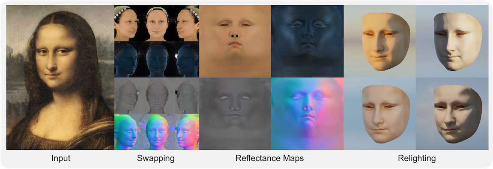

## [Monocular Identity-Conditioned Facial Reflectance Reconstruction](https://xingyuren.github.io/id2reflectance/)

Xingyu Ren, Jiankang Deng, Yuhao Cheng, Jia Guo, Chao Ma, Yichao Yan, Wenhan Zhu and Xiaokang Yang

:star: The implementation for the CVPR2024 paper: [ID2Reflectance](https://openaccess.thecvf.com/content/CVPR2024/papers/Ren_Monocular_Identity-Conditioned_Facial_Reflectance_Reconstruction_CVPR_2024_paper.pdf).

:star: We release an implementation of the multi-domain reflection model in ID2Reflectance.

### Abstract

Recent 3D face reconstruction methods have made remarkable advancements, yet there remain huge challenges in monocular high-quality facial reflectance reconstruction. Existing methods rely on a large amount of light-stage captured data to learn facial reflectance models. However, the lack of subject diversity poses challenges in achieving good generalization and widespread applicability. In this paper, we learn the reflectance prior in image space rather than UV space and present a framework named ID2Reflectance. Our framework can directly estimate the reflectance maps of a single image while using limited reflectance data for training. Our key insight is that reflectance data shares facial structures with RGB faces, which enables obtaining expressive facial prior from inexpensive RGB data thus reducing the dependency on reflectance data. We first learn a high-quality prior for facial reflectance. Specifically, we pretrain multi-domain facial feature codebooks and design a codebook fusion method to align the reflectance and RGB domains. Then, we propose an identity-conditioned swapping module that injects facial identity from the target image into the pre-trained autoencoder to modify the identity of the source reflectance image. Finally, we stitch multi-view swapped reflectance images to obtain renderable assets. Extensive experiments demonstrate that our method exhibits excellent generalization capability and achieves state-of-the-art facial reflectance reconstruction results for in-the-wild faces.

### Dependencies and Installation
- Pytorch >= 1.7.1
- CUDA >= 10.1
- Other required packages in `requirements.txt`
```
# create new anaconda env
conda create -n id2reflectance python=3.8 -y
conda activate id2reflectance

# install python dependencies
pip3 install -r requirements.txt
python basicsr/setup.py develop
conda install -c conda-forge dlib (only for face detection or cropping with dlib)
```
<!-- conda install -c conda-forge dlib -->

### Training and Testing

**Training**
```
python -m torch.distributed.launch --nproc_per_node=4 --master_port=24323 basicsr/train.py -opt options/VQGAN_stage_1.yml --launcher pytorch
or
torchrun --nproc_per_node=4 --master_port=24323 basicsr/train.py -opt options/VQGAN_stage_1.yml --launcher pytorch
```
**Self Reconstruction**
```
# For cropped and aligned faces (512x512)
python inference_reconstruction.py -i [image folder]|[image path] -o [image folder]|[image path]
```

**Face Swapping**
```
python inference_swapping.py -i [image folder]|[image path] -o [image folder]|[image path]
```

### Acknowledgement

This project is based on [BasicSR](https://github.com/XPixelGroup/BasicSR) and [CodeFormer](https://github.com/sczhou/CodeFormer). We also refer [SimSwap](https://github.com/neuralchen/SimSwap) to build our facial reflectance pipeline. Thanks for their awesome works.


### Citation
If our work is useful for your research, please consider citing:

```Bibtex
@InProceedings{Ren_2024_CVPR,
    author    = {Ren, Xingyu and Deng, Jiankang and Cheng, Yuhao and Guo, Jia and Ma, Chao and Yan, Yichao and Zhu, Wenhan and Yang, Xiaokang},
    title     = {Monocular Identity-Conditioned Facial Reflectance Reconstruction},
    booktitle = {Proceedings of the IEEE/CVF Conference on Computer Vision and Pattern Recognition (CVPR)},
    month     = {June},
    year      = {2024},
    pages     = {885-895}
}
```
